# Semantic Segmentation

## Project Introduction
In this project, I'll label the pixels of a road in images using a Fully Convolutional Network (FCN) based on [this paper](https://people.eecs.berkeley.edu/~jonlong/long_shelhamer_fcn.pdf). The architecture of the FCN looks like this:

  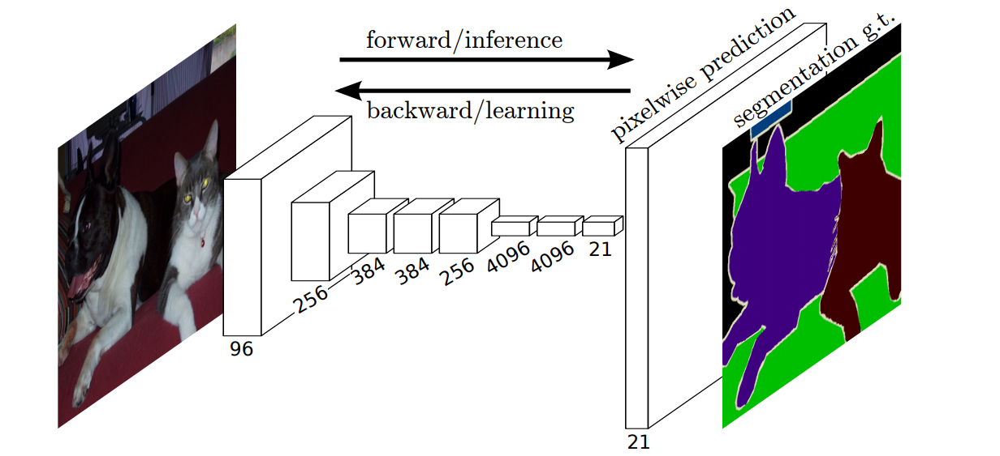

Using this FCN, I can "segment" the pixels on the road that the network believe to be "road" pixels, and color them green to distinguish them from other objects.  Here is an example result:

  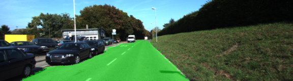

 

## Usage instructions

### GPU
`main.py` will check to make sure you are using GPU - if you don't have a GPU on your system, you can use AWS or another cloud computing platform.

### Frameworks and Packages
Make sure you have the following is installed:
 - [Python 3](https://www.python.org/)
 - [TensorFlow](https://www.tensorflow.org/)
 - [NumPy](http://www.numpy.org/)
 - [SciPy](https://www.scipy.org/)

You may also need [Python Image Library (PIL)](https://pillow.readthedocs.io/) for SciPy's `imresize` function.

### Dataset
Download the [Kitti Road dataset](http://www.cvlibs.net/datasets/kitti/eval_road.php) from [here](http://www.cvlibs.net/download.php?file=data_road.zip).  Extract the dataset in the `data` folder.  This will create the folder `data_road` with all the training a test images.

### Run
* To configure and train the model:  `python main.py` 
* Generate an optimized graph using the following commands:
  * `git clone https://github.com/tensorflow/tensorflow.git`
  * `python tensorflow\tensorflow\python\tools\freeze_graph.py --input_graph=FCN8-graph.pb --input_checkpoint=FCN8.ckpt --input_binary=true --output_graph=FCN8-frozen.pb  --output_node_names=Reshape`
  * `python tensorflow\tensorflow\python\tools\optimize_for_inference.py --input=FCN8-frozen.pb --output=FCN8-optimized.pb --frozen_graph=True --input_names=image_input --output_names=Reshape`
* To add segmentation to videos: `python convert_video.py --file <INPUT_MP4_FILENAME>`

## [Rubric Points](https://review.udacity.com/#!/rubrics/989/view)

Here I will consider the rubric points individually.

### Build the Neural Network

This is all verified by the provided unit tests, which all pass with my changes.

#### Does the project load the pretrained vgg model?
The `load_vgg` function loads the following tensors from vgg: input, keep_prob, and layers 3,4, and 7.

#### Does the project learn the correct features from the images?
The `layers` function implements a Fully Convolutional Network based on the work described in [this paper](https://people.eecs.berkeley.edu/~jonlong/long_shelhamer_fcn.pdf):

  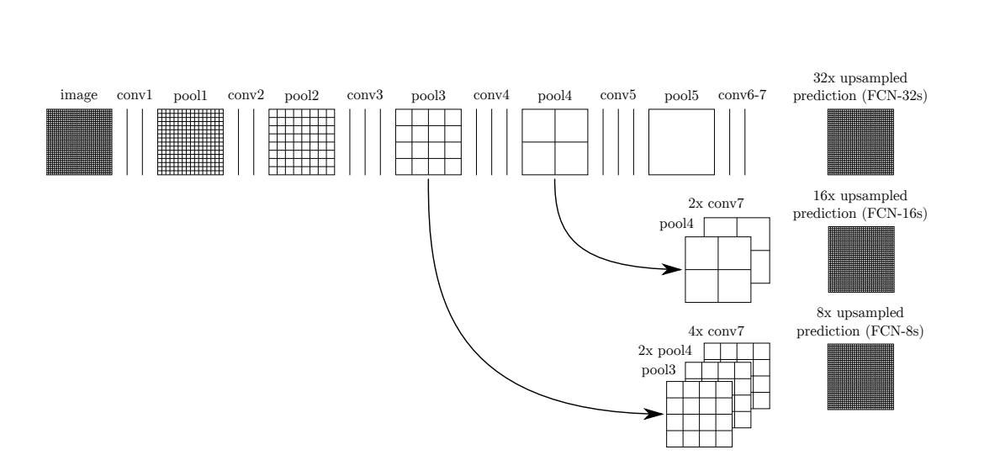

 

Here is a description of the new layers added on to VGG:
1. A 1x1 convolution of the output of VGG (layer 7).  
2. An "upsample" (i.e. "transpose") of the result of step 1 to increase the size by 2x 
3. A 1x1 convolution of VGG layer 4 
4. Add the results of step 2 and 3 (i.e. "add a skip layer")
5. Upsample the output of step 4 by 2x
6. A 1x1 convolution of VGG layer 3
7. Add the results of step 5 and 6 (i.e. "add a skip layer")
8. Upsample the output of step 7 by 8x

#### Does the project optimize the neural network?
The `optimize` function implements the details of the neural net optimization.  I use an Adam optimizer to reduce cross entropy loss.

#### Does the project train the neural network?
The `train_nn` function implements the training sequence.  Average loss per epoch is printed to the console.

### Neural Network Training
#### Does the project train the model correctly? 
Average loss for epoch 1 is 6.213.  Over time this is slowly reduced, and epoch 50 has a average loss of 0.034.

#### Does the project use reasonable hyperparameters?
I used the following hyperparameters:

| Parameter                |  Value | 
|:------------------------:|:------:| 
| Epochs                   |   50   | 
| Batch Size               |    5   |
| Learning Rate            | 0.0005 |
| Dropout Keep Probability |   50%  |

#### Does the project correctly label the road?
According to the rubric "A solution that is close to best would label at least 80% of the road and label no more than 20% of non-road pixels as road."

Initially, I had set my learning rate to 0.001 and epochs to 25.  The results were not great, so I arrived at the final hyperparameters described above.

Here are a few example images that compare my initial and final runs:

  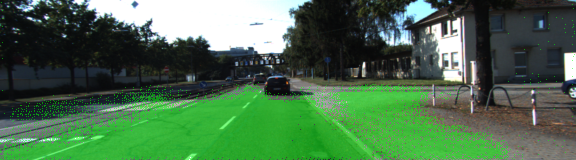 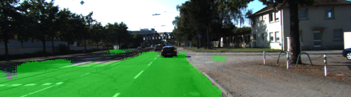
  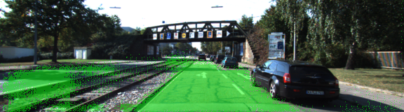 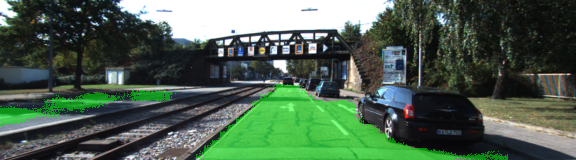
  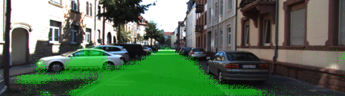 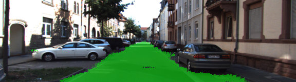
  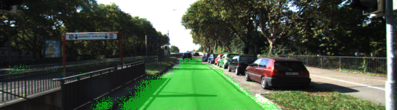 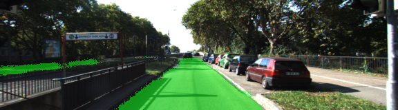
  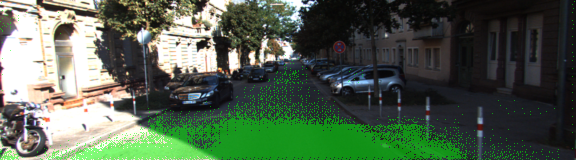 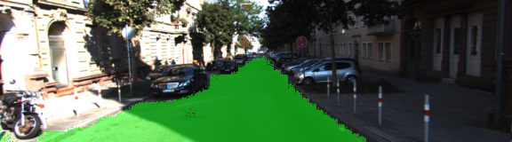

 

## Application to videos
I also chose to freeze my model, and import it into another script I wrote called `convert_video.py`.  This script imports the frozen neural network, and uses it to make predictions on fames in a video.  It then takes the resulting images and stitches them into an output video. I grabbed two example videos from the [Advanced Lane Detection Project](https://github.com/dylanbrandtner/CarND-Advanced-Lane-Lines-P4) and converted the first 10 seconds of each. 

Here is the results:

#### "Project" Video

  

 

You can also download the full video [here]( "./project_video_out.mp4")

#### "Challenge" Video

  

 

You can also download the full video [here]( "./challenge_video_out.mp4")

## Reflection

Overall, this project was quite interesting.  The initial problem this was solving (i.e. labeling each part of the image) was even more interesting, so I wish we were able to train a model to categorize everything, not just roads (i.e. pedestrians, signs, etc).  Although, perhaps the available resources were not enough to reasonably train such a complex model.   I especially enjoyed the challenge of freezing and optimizing a model, and reading it back in to apply to videos.  However, for some reason my processing pipeline always crashed python after 20 images, and I never could determine why.  It seemed like it was due to python running out of memory (perhaps a tensorflow memory leak?).  In any case, this made the video conversion process very tedious.  I wish a bit more time was spent in the lesson materials about loading in a frozen model and using it, as I found the available documentation online to be sparse and often outdated.  
